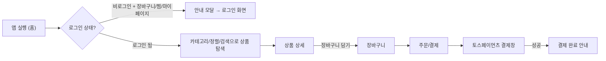

# 🥤 LocknLock — 텀블러 전용 쇼핑몰

> 락앤락 텀블러 브랜드를 위한 모바일 우선 반응형 쇼핑몰. 데스크탑에서는 브랜드 비주얼과 실제 앱 화면이 나란히 보이는 Split-Screen으로, 모바일에서는 실제 쇼핑 앱과 동일한 단일 컬럼 화면으로 동작합니다.

배포 링크: [바로가기](https://lockn-lock.vercel.app/) · 노션 기획서: [바로가기](https://app.notion.com/p/Project-2-LocknLock-803a60f26a9a83c7a2f701e1660d3d3f?source=copy_link) · 디자인 시안(Figma): [바로가기](https://www.figma.com/design/vlM1bKLwbUBvx8B7I0nobb/LocknLock-%EC%9B%B9%EC%95%B1?node-id=0-1&t=kBIYjjyBoUwS1gko-1)

## ✨ 주요 기능 & 인터랙션

### 1. 반응형 Split-Screen 레이아웃
481px를 기준으로 완전히 다른 두 화면을 제공합니다. **데스크탑**에서는 좌측에 브랜드 카피·로고·비주얼 이미지가 배치되고, 우측에는 실제 모바일 쇼핑몰 화면이 고정 크기(`clamp(320px, 45vw, 420px)`)로 삽입되어 하나의 목업처럼 보입니다. **모바일**(480px 이하)에서는 좌측 브랜드 패널이 사라지고 앱 화면이 전체 뷰포트를 차지합니다. 두 레이아웃은 하나의 HTML/CSS로 미디어쿼리만으로 전환되며, 별도의 모바일 전용 페이지를 두지 않았습니다.

### 2. 사이드바 드로어 & 로그인 상태 분기
햄버거 버튼을 누르면 좌측에서 드로어가 슬라이드로 열리며, 카테고리(텀블러·유아용·스포츠용·휴대용·식탁용·뚜껑/빨대) 6종과 서비스 메뉴(고객센터·브랜드 스토리)로 이동할 수 있습니다. 드로어 상단은 **로그인 여부에 따라 완전히 다른 내용**을 보여줍니다 — 비로그인 상태에서는 일반/구글 로그인과 회원가입 버튼 3개가, 로그인 후에는 프로필 사진·닉네임·로그아웃 버튼이 노출됩니다. 장바구니·찜·마이페이지처럼 로그인이 필요한 탭을 비로그인 상태로 누르면 안내 모달이 뜨고 자동으로 로그인 화면으로 이동합니다.

### 3. 상품 정렬 · 필터 · 검색
모든 상품 목록 화면(홈, 카테고리별 목록)에는 정렬 드롭다운(추천순/판매인기순/낮은가격순/높은가격순)과 가격대 프리셋 필터가 동일한 구조로 반복 적용됩니다. 정렬은 DOM에 렌더링된 카드를 실제로 재정렬하는 방식이라 서버 통신 없이도 즉시 반영되며, "추천순"으로 되돌리면 최초 진열 순서를 그대로 복원합니다. 카테고리 목록 페이지에는 검색창과 "오늘출발" 칩 필터가 추가로 있어 두 조건을 동시에 적용할 수 있습니다.

### 4. 장바구니 · 찜하기 · 최근 본 상품 (실시간 상태 관리)
세 기능 모두 새로고침 시 초기화되는 메모리 전용 상태(JS 배열)로 관리되며, 상품 카드의 하트/장바구니 버튼을 누르는 즉시 배지 숫자와 목록이 다시 그려집니다. 장바구니는 개별/전체 선택 후 일괄 삭제, 수량 증감에 따른 실시간 총액·배송비(3만원 이상 무료) 재계산을 지원하고, 최근 본 상품은 중복 시 최신 위치로 끌어올리며 최대 10개까지만 유지됩니다.

### 5. 토스페이먼츠 결제 연동
결제 페이지에서 "토스페이로 결제하기" 버튼을 누르면 실제 TossPayments SDK(`requestPayment`)를 호출해 결제창을 띄웁니다. 필수 약관 미동의 시 결제를 막고, 결제 성공/실패 후 리다이렉트되는 URL 쿼리 파라미터(`?payment=success` 등)를 감지해 성공/실패 안내 모달을 띄우고 장바구니를 비웁니다.

### 6. 미연결 기능에 대한 공용 안내 모달
버튼/링크 클릭 이벤트를 전역에서 감지해, 실제로 기능이 연결된 요소 목록(`CONNECTED_SELECTORS`)에 없는 모든 클릭에 대해 "해당 기능은 현재 연결 작업 중입니다" 모달을 자동으로 띄우도록 설계했습니다. 목업 단계의 쇼핑몰에서 깨진 링크 없이 일관된 사용자 경험을 유지하기 위한 장치입니다.

## 🧭 사용자 플로우


## 🗂️ 폴더 구조
```
LocknLock/
├── index.html      # 전체 페이지(홈/목록/상세/장바구니/결제/마이페이지 등)를 한 파일에 구성한 SPA
├── style.css        # 전역 스타일, Split-Screen 반응형 레이아웃, 컴포넌트별 스타일
├── main.js          # 페이지 라우팅(goToPage), 장바구니·찜·최근본상품 상태관리, Firebase Auth, 토스페이먼츠 연동
├── README.md         # 프로젝트 개요 문서
└── img/              # 상품 및 브랜드 비주얼 이미지 자산
```
빌드 도구나 프레임워크 없이 Vanilla HTML/CSS/JS로만 구성했고, 모든 페이지 전환은 `.page-section`을 보였다 숨겼다 하는 방식(진짜 SPA 라우팅이 아닌 단일 문서 내 화면 전환)으로 구현했습니다.

## 🤖 AI 활용 프로세스
기획부터 개발까지 각 단계에서 AI를 1차 초안 생성 도구로 활용하고, 실제 코드/디자인 맥락에 맞는지 검증한 뒤 직접 수정하는 방식으로 작업했습니다.

**① 기획 단계 — 타겟 고객 정의**
텀블러 쇼핑몰을 시작하기 전, 어떤 고객층을 대상으로 카테고리와 메시지를 설계해야 할지 AI에게 페르소나 초안을 요청했습니다.
> "텀블러 전문 쇼핑몰을 만들려고 해. 20~40대 소비자를 대상으로 한 주요 타겟 페르소나 2~3개를 나이대, 라이프스타일, 텀블러 구매 동기 중심으로 정리해줘."

AI가 제시한 페르소나 중 실제 상품 라인업(유아용·스포츠용 카테고리 포함)과 맞지 않는 부분은 걸러내고, 카테고리 구성에 반영할 페르소나만 추려서 사용했습니다.

**② 디자인 단계 — Split-Screen 레이아웃 기준 리서치**
데스크탑에서 모바일 앱 화면을 그대로 보여주는 레이아웃을 어떻게 잡아야 할지 기준이 필요해 AI에게 리서치를 요청했습니다.
> "데스크탑 화면에서는 브랜드 이미지와 카피가 있는 영역, 모바일 앱 미리보기 영역이 나뉘는 2단 Split-Screen 레이아웃을 만들고 싶어. 일반적으로 이런 레이아웃에서 좌우 영역 비율과 모바일 프리뷰 영역의 적정 너비를 어떻게 잡는 게 좋을지 알려줘."

AI가 제안한 비율을 그대로 쓰지 않고 실제 콘텐츠 길이에 맞춰 `clamp(320px, 45vw, 420px)`처럼 화면 크기에 따라 유동적으로 조정되는 값으로 다시 조정했습니다.

**③ 개발 단계 — 드로어(사이드바) 메뉴 구조 초안**
사이드바 드로어 메뉴의 기본 구조를 AI로 먼저 생성했습니다.
> "쇼핑몰 사이드바 드로어 메뉴를 만들어줘. 카테고리 목록, 서비스 메뉴, 로그인 상태에 따라 다르게 보이는 상단 영역으로 구성해줘."

AI가 만든 초안은 일반적인 쇼핑몰 카테고리(의류, 잡화 등) 기준이라 실제 텀블러 상품 라인업(일반/유아용/스포츠용/휴대용/식탁용/뚜껑·빨대)과 구조가 맞지 않았고, 카테고리 목록과 아이콘을 직접 상품 구성에 맞게 다시 정리했습니다.

**④ 카피라이팅 — 브랜드 소개 문구**
홈 화면 상단 브랜드 소개 카드에 들어갈 문구를 AI로 여러 톤을 받아본 뒤 선택했습니다.
> "락앤락 텀블러 브랜드 소개 문구를 써야 해. 50년 역사와 밀폐력 기술력을 강조하면서도 소비자 삶의 질 향상을 이야기하는 짧은 소개 문단 2개를 제안해줘."

AI가 제안한 문구 중 지나치게 기업 슬로건처럼 딱딱한 안은 제외하고, "고객의 삶을 풍요롭게"처럼 더 담백하고 소비자 친화적인 표현으로 다듬어 최종 반영했습니다.

**⑤ 트러블슈팅 — 원인 진단**
드로어 메뉴와 페이지 전환 로직이 충돌하는 버그가 발생했을 때도, 증상을 AI에게 설명해 원인 후보를 먼저 받아본 뒤 실제 원인을 좁혀 나갔습니다. (아래 트러블슈팅 표 참고)

## 🩹 트러블슈팅
| 이슈 | 원인 | 해결 |
|---|---|---|
| 드로어 메뉴의 카테고리 링크를 눌러 페이지를 이동하면 하단 탭바의 활성 탭 표시가 어긋남 | `data-page` 트리거를 누를 때마다 하단 탭바 활성 상태(`syncTab`)를 무조건 동기화하도록 되어 있어, 드로어 링크로 이동해도 탭바가 엉뚱한 탭을 활성 표시함 | 탭바 버튼·로고 클릭일 때만 `syncTab: true`를 적용하도록 조건을 분리하고, 드로어 링크는 기존 탭 상태를 유지하도록 수정 |
| 뒤로가기 버튼을 여러 번 누르면 페이지 히스토리가 꼬여 엉뚱한 화면으로 이동 | 페이지 이동 기록(`pageHistory`)을 배열로 직접 관리하다 보니, 드로어 닫기·모달 확인 등 부가 동작에서도 히스토리가 중복으로 쌓임 | 페이지 이동은 `goToPage` 한 곳에서만 히스토리에 push하도록 통일하고, 뒤로가기 시에는 `isBack` 플래그로 별도 처리 |

## 📄 저작권표시
© 2026 LocknLock Tumbler Store. All Rights Reserved.
